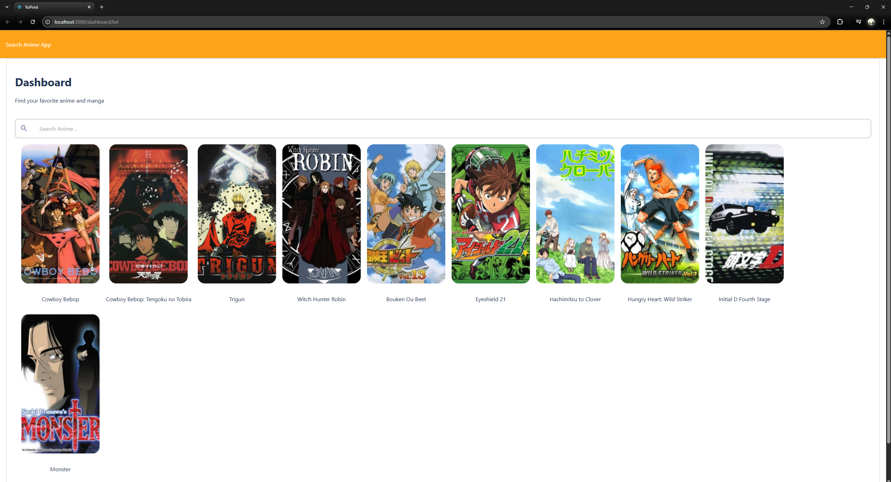
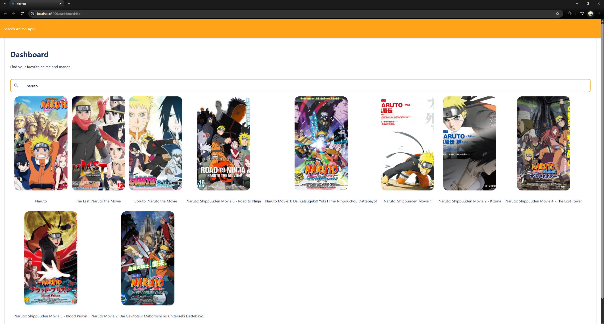
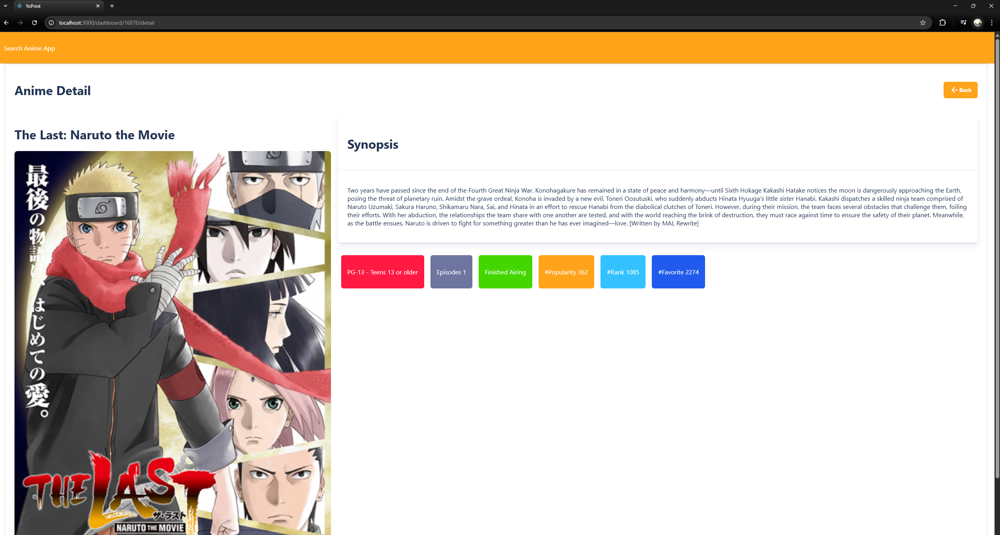

# Yoprint Mini Project

A mini React + TypeScript project built for assessment.

## Features

- React 18 with Hooks
- React Router
- Server-side pagination with instant search
- MUI component library

## Overview





## Setup

```bash
npm install
npm start

